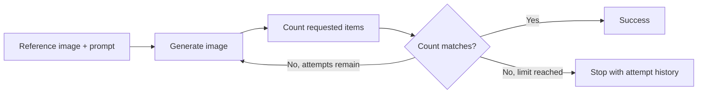

# Image Gen Playbook

Practical, notebook-first tutorials for building image generation workflows—from a single model call to a production-style generator–evaluator loop with LangGraph.

The examples use Gemini for image generation and visual evaluation. They cover reference-image inputs, structured model responses, validation, retry logic, error handling, and complete attempt histories.

## What you'll learn

- Generate an image from text and reference images
- Keep image data in memory using base64 encoding
- Ask a vision model to evaluate generated output
- Model a generator–evaluator workflow as a LangGraph state machine
- Retry failed or incorrect generations up to a fixed limit
- Preserve useful output and error details from every attempt

## Learning path

| Notebook | What it covers |
| --- | --- |
| [`image_generation.ipynb`](notebooks/image_generation.ipynb) | The starting point: download two reference images, send them to Gemini with a prompt, display the generated image, and compare item-count evaluations from vision models. |
| [`basic_generator_evaluator_langgraph.ipynb`](notebooks/basic_generator_evaluator_langgraph.ipynb) | A model-free introduction to the generator–evaluator pattern using random numbers, conditional routing, and bounded retries. |
| [`image_generator_evaluator_langgraph.ipynb`](notebooks/image_generator_evaluator_langgraph.ipynb) | The complete workflow: generate an image, evaluate a visual constraint with structured output, retry when it does not match, and retain the history of every attempt. |

Rendered HTML versions of the main image notebooks are available in [`notebooks/exports`](notebooks/exports) for quick viewing without Jupyter.

## How the production workflow works



The LangGraph notebook separates generation, observation, and decision-making into distinct nodes:

1. `generate_image` calls the image model and records either the output or the error.
2. `count_items_in_generated_image` uses a vision model and a Pydantic schema to produce a structured count and feedback.
3. `evaluate_image` compares the observed count with the requested count.
4. Conditional routing either ends the graph or starts another generation attempt.

This example checks object count, but the evaluator can be adapted for other measurable requirements such as composition, color usage, text presence, brand compliance, or safety rules.

## Requirements

- Python 3.11 or newer
- [`uv`](https://docs.astral.sh/uv/)
- A Gemini API key with access to the models configured in the notebooks
- Internet access for API calls and the example reference-image URLs

## Getting started

Clone the repository and install the locked dependencies:

```bash
git clone <repository-url>
cd image-gen-playbook
UV_CACHE_DIR=.uv-cache uv sync
```

Set your Gemini API key:

```bash
export GEMINI_API_KEY="your-api-key"
```

Then start Jupyter:

```bash
UV_CACHE_DIR=.uv-cache uv run jupyter lab
```

Open the notebooks in the order shown above. If Jupyter asks for a kernel, select the Python environment from `.venv`.

The notebooks also prompt for `GEMINI_API_KEY` securely when the environment variable is not set. The key is not printed or stored in the repository.

## Customize the example

In the basic image-generation notebook, change:

- `IMAGE_1_URL` and `IMAGE_2_URL` to direct, publicly accessible image URLs
- `PROMPT` to describe the desired image and constraints
- `MODEL` and `aspect_ratio` as needed

In the LangGraph image workflow, change:

- `user_image_url` for the reference image
- `generation_prompt` for the generation instructions
- `expected_item_name` and `expected_item_count` for the evaluated constraint
- `GENERATION_MODEL`, `VISION_MODEL`, `MAX_ATTEMPTS`, and `ASPECT_RATIO` for runtime behavior

Model availability can vary by account and over time, so update the configured model IDs if necessary.

## Project structure

```text
.
├── notebooks/
│   ├── image_generation.ipynb
│   ├── basic_generator_evaluator_langgraph.ipynb
│   ├── image_generator_evaluator_langgraph.ipynb
│   └── exports/
├── pyproject.toml
├── uv.lock
└── README.md
```

## Notes

- The main workflows keep downloaded and generated image bytes in memory; they do not save images to disk.
- Generation and evaluation both consume API resources and may incur charges.
- Model evaluation is probabilistic. A successful count is evidence that the output meets the example constraint, not a guarantee of overall image quality.
- Only use reference images you have permission to process.

## License

No license has been added yet. Add one before redistributing or accepting external contributions.
